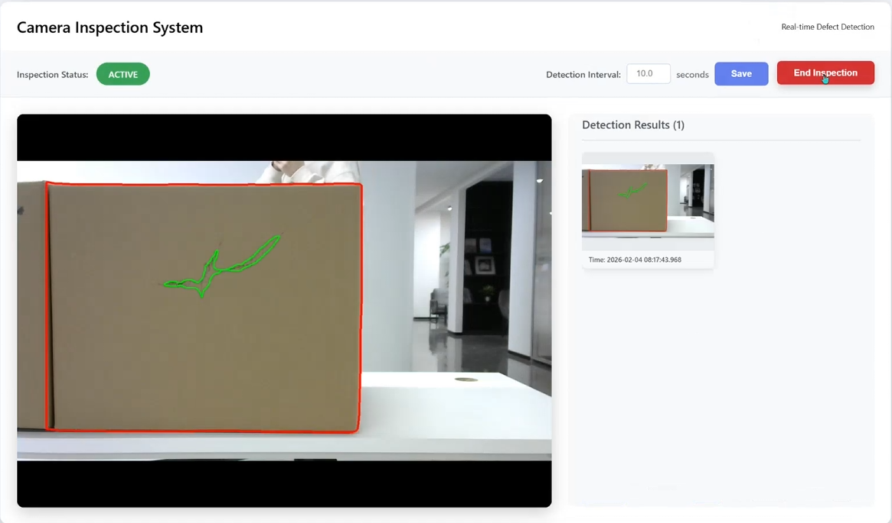

# SegmentAnything

robohub 示例 13.

## 功能特性
- **用户友好的 Python API**：高级 Python 接口，抽象了复杂的 QNN C++ 示例，允许在骁龙（Snapdragon）平台上快速原型开发。
- **实时检测**：采用两阶段分割方案：先使用 YOLOv8 分割出目标物体的表面区域，再通过 SAM 对表面缺陷进行精准分割。

## 技术栈
- **核心**：Python 3.12+
- **后端**：QNN 2.36
- **Web 框架**：Flask（WSGI）
- **计算机视觉**：OpenCV（cv2）
- **操作系统支持**：Ubuntu 24.04（Noble Numbat）

## 核心工作流程
1.  **目标检测**：使用 YOLOv8 识别并生成目标物体（例如纸箱）的掩码。
2.  **区域提取（裁剪）**：利用检测得到的掩码/边界框（bounding box）从原始高分辨率帧中裁剪出目标物体。
3.  **缺陷分割**：裁剪后的图像被传递给 **SAM（Segment Anything 模型）**，该模型仅聚焦于局部区域，以高精度分割出表面缺陷。  
4.  **可视化与存储**：最终结果会叠加到原始视频流上，展示在监控面板中，并保存至参数 `--save-dir` 指定的目录。  

## 快速开始
### 1. 前置条件
``` bash
cd .
sudo apt update
sudo apt install python3-venv python3-pip qcom-fastrpc1 qcom-fastrpc-dev -y
```

### 2. 安装
```bash
cd .
python3 -m venv venv
source venv/bin/activate
pip3 install -r requirements.txt
```
### 3. 获取模型文件
使用本项目需要先下载模型文本，并将它们移动到目录 **resources** 下。
[下载](https://huggingface.co/dev2hf/robohub_example13)  

### 4. 获取 QNN 资源
使用本项目需先获取高通（Qualcomm）QNN SDK v2.36.0.250627。

**步骤**：
1. 下载 Qualcomm QNN SDK v2.36.0.250627.
2. 将 SDK 解压缩到您的本地机器。
3. 传入 SDK 路径运行以下脚本

```bash
./extract_qnn_deps.sh /path/your/qnn/2.36.0.250627
```

### 5. 构建依赖项
⚠️ **前置条件：infertoypy 安装**

本项目依赖**infertoypy**，该依赖已以压缩包形式包含在 opensource_qnn_sample / 目录下。
由于其构建要求较为复杂，此处无法详细说明安装步骤。你必须执行以下操作：

```bash
cd opensource_qnn_sample
tar -zxvf release_infertoy_*.tgz
cd release_infertoy
```

**后续步骤**：
1. 仔细阅读并遵循该目录下的 README 文件中的说明。该文件包含针对特定系统编译该库的详细步骤。

2. 继续操作前，请确认 infertoypy 已安装成功。

**注意**：请勿跳过此步骤，否则主应用程序将无法启动。

### 6. 使用方法
```bash
./start.sh --source 0 --resolution 1280 720 --class-id 0 --port 3333 --save-dir ./save
```

访问 http://localhost:3333 打开监控面板（Monitoring Dashboard）。  
主界面展示实时摄像头画面。检测算法激活后，红色轮廓线会勾勒出纸箱的边缘，绿色掩码会高亮显示检测到的表面缺陷。  
捕获到的缺陷帧会保存到本地，并展示在右侧面板中以便快速查看（点击可查看全分辨率图像）。视频流按时间顺序排序，最新的检测结果显示在顶部。  
为确保与不同生产速度无缝集成，检测间隔可根据具体的流水线工作流程进行自定义配置。  



## 配置
您可以通过传递以下命令行参数来自定义 YOLOv8 + SAM2 WebUI 的执行：

### 参数概述
| 参数 | 类型 | 默认值 | 描述 |
| :--- | :--- | :--- | :--- |
| `--source` | `str` | **必需** | 视频流的源（例如，摄像头 ID `0` 或 RTSP 流 URL）。 |
| `--resolution` | `int` `int` | `1280` `720` | 摄像头输入流的宽度和高度。 |
| `--class-id` | `int` | `0` | 希望 YOLOv8 检测的特定类别 ID（例如，0 代表纸箱）。 |
| `--port` | `int` | `3333` | Web 服务器运行的端口号。 |
| `--save-dir` | `str` | `None` | 检测和分割结果保存的目录路径。 |

---

## 故障排除
### 1. QNN 环境错误（初始化失败）
**问题**：应用程序初始化模型失败，或抛出与缺失.so库相关的错误。

**原因**：这通常是由于指向 QNN SDK 动态库的环境变量缺失或配置错误导致。

**解决方案**：启动应用程序前，确保ADSP_LIBRARY_PATH和LD_LIBRARY_PATH环境变量已导出并指向包含 QNN 库的目录：
```bash
# 获取项目目录的绝对路径
export PROJ_ROOT=$(pwd)

export LD_LIBRARY_PATH=$PROJ_ROOT/resources/qnn236:$LD_LIBRARY_PATH
export ADSP_LIBRARY_PATH=$PROJ_ROOT/resources/qnn236
```

### 2. 摄像头流警告（JPEG 数据损坏）
**问题**：控制台充斥着类似 Corrupt JPEG data: 2 extraneous bytes before marker 0xd5 的警告。

**原因**：这是部分 UVC 摄像头或底层 V4L2 驱动的常见问题，当 JPEG 流包含非标准标记或填充字节时会触发。

**解决方案**：这些警告通常不影响程序运行，若画面显示正常可忽略；如果你的摄像头支持 YUYV 格式，可尝试在源码中修改像素格式为 YUYV。

找到 python/run.py 文件中第 54-55 行，按如下方式交换注释行：

**原始代码（默认）**：
```python
self.cap.set(cv2.CAP_PROP_FOURCC, cv2.VideoWriter_fourcc(*'MJPG'))
# self.cap.set(cv2.CAP_PROP_FOURCC, cv2.VideoWriter_fourcc(*'YUYV'))
```
**更新代码（YUYV）**：
```python
# self.cap.set(cv2.CAP_PROP_FOURCC, cv2.VideoWriter_fourcc(*'MJPG'))
self.cap.set(cv2.CAP_PROP_FOURCC, cv2.VideoWriter_fourcc(*'YUYV'))
```

## 📄 许可证
Copyright (c) 2026, Qualcomm Innovation Center, Inc. All rights reserved.

This project is licensed under the **BSD 3-Clause License (SPDX: BSD-3-Clause)**.  
A copy of the license is included in the [LICENSE](LICENSE) file.
